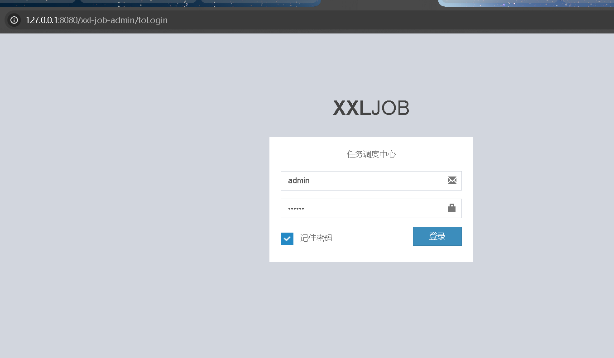
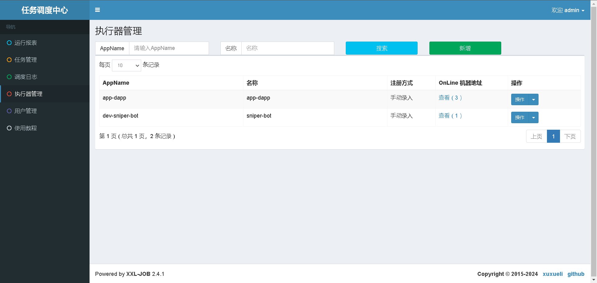
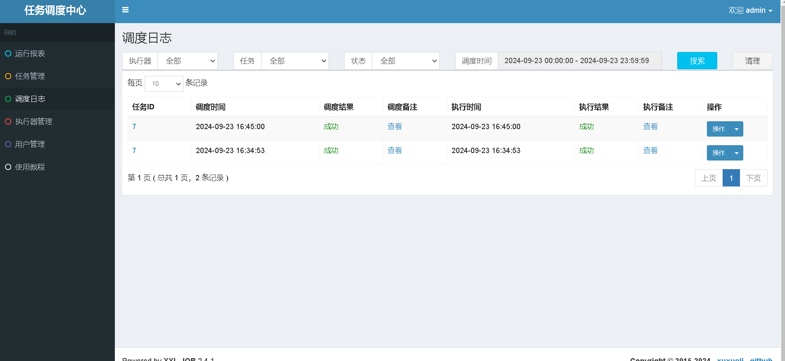
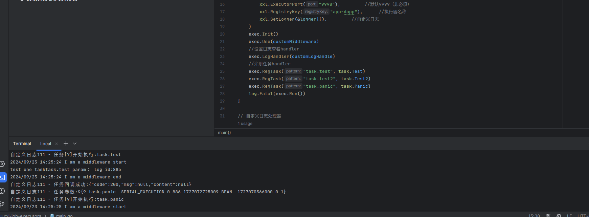

Docker 镜像方式搭建调度中心：

1.// Docker地址：https://hub.docker.com/r/xuxueli/xxl-job-admin/     (建议指定版本号)
docker pull xuxueli/xxl-job-admin
我着拉取的镜像是:xuxueli/xxl-job-admin:2.4.1
执行： docker ps -a 查找这个镜像是否存在xuxueli/xxl-job-admin:2.4.1

2.配置对应的数据库数据，因为里面的用户存储、日志存储、任务调度存储在对应的数据库里面
配置sql文件：https://github.com/xuxueli/xxl-job/blob/master/doc/db/tables_xxl_job.sql

3.启动docker镜像，这里需要连接对应端口的数据库，我的数据库在docker里
执行代码：docker run -e PARAMS="--spring.datasource.url=jdbc:mysql://127.0.0.1:33060/xxl_job?
useUnicode=true&characterEncoding=UTF-8&autoReconn^Ct=true&serverTimezone=Asia/Shanghai 
--spring.datasource.username=root --spring.datasource.password=123456" -p 8080:8080 -v /tmp:/data/applogs --name xxl-job-admin-new-2 -d xuxueli/xxl-job-admin:2.4.1

4.访问http://127.0.0.1:8080/xxl-job-admin

5.登录： admin/123456      (位于 xxl_job_user 表)

6.注册一个执行管理器

7.写一个任务任务执行器，注册到xxl-job-admin里，管理调度执行器，回调执行器执行对应的任务，可以通过注册节点(OnLine 机器地址[例:http://127.0.0.1:9998]手动注入需要加http)
 

8.执行器完全遵守API Reful 风格
说明：执行器执行完任务后，回调任务结果时使用
------
地址格式：{调度中心根地址}/api/callback
Header：
    XXL-JOB-ACCESS-TOKEN : {请求令牌}
请求数据格式如下，放置在 RequestBody 中，JSON格式：
    [{
        "logId":1,              // 本次调度日志ID
        "logDateTim":0,         // 本次调度日志时间
        "handleCode":200,       // 200 表示任务执行正常，500表示失败
        "handleMsg": null
        }
    }]
响应数据格式：
    {
      "code": 200,      // 200 表示正常、其他失败
      "msg": null      // 错误提示消息
    }

    地址格式：{调度中心根地址}/api/registry
Header：
    XXL-JOB-ACCESS-TOKEN : {请求令牌}
请求数据格式如下，放置在 RequestBody 中，JSON格式：
    {
        "registryGroup":"EXECUTOR",                     // 固定值
        "registryKey":"xxl-job-executor-example",       // 执行器AppName
        "registryValue":"http://127.0.0.1:9999/"        // 执行器地址，内置服务跟地址
    }
响应数据格式：
    {
      "code": 200,      // 200 表示正常、其他失败
      "msg": null      // 错误提示消息
    }

    执行器注册摘除
    地址格式：{调度中心根地址}/api/registryRemove
Header：
    XXL-JOB-ACCESS-TOKEN : {请求令牌}
请求数据格式如下，放置在 RequestBody 中，JSON格式：
    {
        "registryGroup":"EXECUTOR",                     // 固定值
        "registryKey":"xxl-job-executor-example",       // 执行器AppName
        "registryValue":"http://127.0.0.1:9999/"        // 执行器地址，内置服务跟地址
    }
响应数据格式：
    {
      "code": 200,      // 200 表示正常、其他失败
      "msg": null      // 错误提示消息
    }

    心跳检测
说明：调度中心检测执行器是否在线时使用
------
地址格式：{执行器内嵌服务根地址}/beat
Header：
    XXL-JOB-ACCESS-TOKEN : {请求令牌}
请求数据格式如下，放置在 RequestBody 中，JSON格式：
响应数据格式：
    {
      "code": 200,      // 200 表示正常、其他失败
      "msg": null       // 错误提示消息
    }

忙碌检测
说明：调度中心检测指定执行器上指定任务是否忙碌（运行中）时使用
------
地址格式：{执行器内嵌服务根地址}/idleBeat
Header：
    XXL-JOB-ACCESS-TOKEN : {请求令牌}
请求数据格式如下，放置在 RequestBody 中，JSON格式：
    {
        "jobId":1       // 任务ID
    }
响应数据格式：
    {
      "code": 200,      // 200 表示正常、其他失败
      "msg": null       // 错误提示消息
    }

    触发任务
说明：触发任务执行
------
地址格式：{执行器内嵌服务根地址}/run
Header：
    XXL-JOB-ACCESS-TOKEN : {请求令牌}
请求数据格式如下，放置在 RequestBody 中，JSON格式：
    {
        "jobId":1,                                  // 任务ID
        "executorHandler":"demoJobHandler",         // 任务标识
        "executorParams":"demoJobHandler",          // 任务参数
        "executorBlockStrategy":"COVER_EARLY",      // 任务阻塞策略，可选值参考 com.xxl.job.core.enums.ExecutorBlockStrategyEnum
        "executorTimeout":0,                        // 任务超时时间，单位秒，大于零时生效
        "logId":1,                                  // 本次调度日志ID
        "logDateTime":1586629003729,                // 本次调度日志时间
        "glueType":"BEAN",                          // 任务模式，可选值参考 com.xxl.job.core.glue.GlueTypeEnum
        "glueSource":"xxx",                         // GLUE脚本代码
        "glueUpdatetime":1586629003727,             // GLUE脚本更新时间，用于判定脚本是否变更以及是否需要刷新
        "broadcastIndex":0,                         // 分片参数：当前分片
        "broadcastTotal":0                          // 分片参数：总分片
    }
响应数据格式：
    {
      "code": 200,      // 200 表示正常、其他失败
      "msg": null       // 错误提示消息
    }

    终止任务
说明：终止任务
------
地址格式：{执行器内嵌服务根地址}/kill
Header：
    XXL-JOB-ACCESS-TOKEN : {请求令牌}
请求数据格式如下，放置在 RequestBody 中，JSON格式：
    {
        "jobId":1       // 任务ID
    }
响应数据格式：
    {
      "code": 200,      // 200 表示正常、其他失败
      "msg": null       // 错误提示消息
    }

    查看执行日志
说明：终止任务，滚动方式加载
------
地址格式：{执行器内嵌服务根地址}/log
Header：
    XXL-JOB-ACCESS-TOKEN : {请求令牌}
请求数据格式如下，放置在 RequestBody 中，JSON格式：
    {
        "logDateTim":0,     // 本次调度日志时间
        "logId":0,          // 本次调度日志ID
        "fromLineNum":0     // 日志开始行号，滚动加载日志
    }
响应数据格式：
    {
        "code":200,         // 200 表示正常、其他失败
        "msg": null         // 错误提示消息
        "content":{
            "fromLineNum":0,        // 本次请求，日志开始行数
            "toLineNum":100,        // 本次请求，日志结束行号
            "logContent":"xxx",     // 本次请求日志内容
            "isEnd":true            // 日志是否全部加载完
        }
    }

